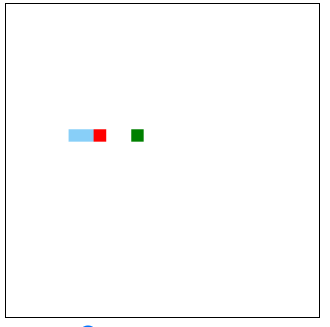

# LuckyGame

# 功能简介
- 实现游戏资源预加载功能，程序运行前从资源管理器中预加载图片、声音等资源，无需在运行过程中重复加载，提高游戏运行时的性能。
- 实现游戏对象管理，如游戏中的静态对象、动态对象的抽象管理。
- 实现事件注册机制，支持开发时易于注册键盘事件和响应函数，提高开发效率。
- 支持游戏场景抽象功能，实现游戏在不同场景中任意切换。
- 实现双向绑定机制，支持在游戏运行中实时暂停游戏、修改游戏FPS、角色运动速度、子弹等效果。

# 功能展示
- 贪吃蛇
  - 

- 飞机大战
  - 
 
- Flapply Bird
  - 
